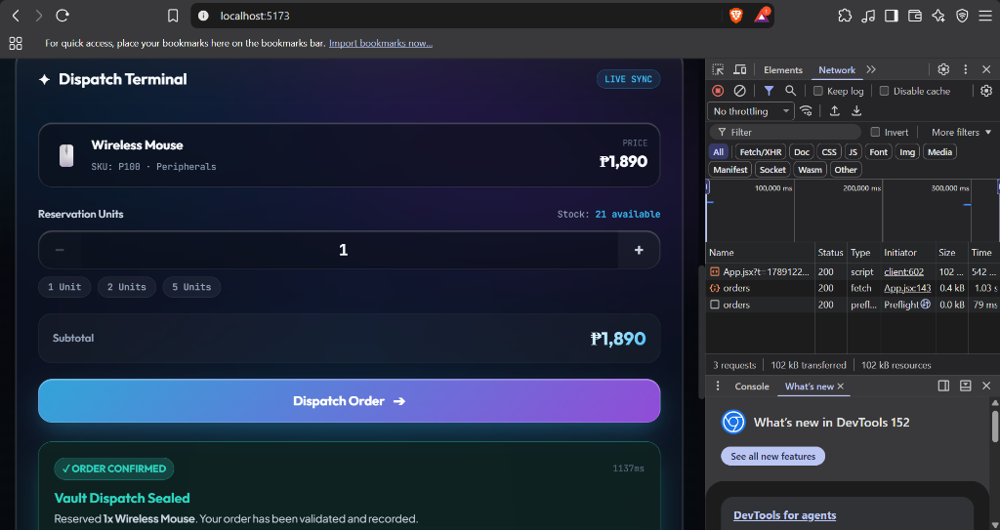
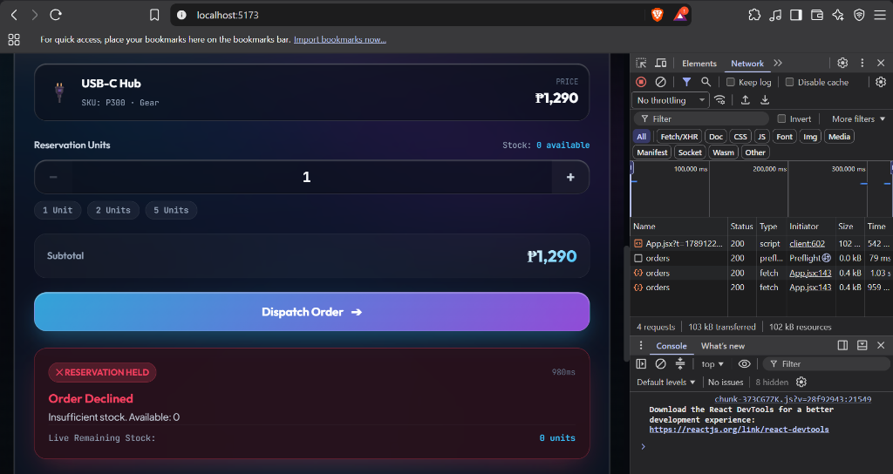

# Ylan's Shop — In-Process Order & Inventory Management System

A modular in-process e-commerce system built with Spring Boot, Supabase PostgreSQL, and a React Spatial UI. This project demonstrates modular boundary enforcement within a monolithic backend, integrating order dispatch and inventory reservation in-process while maintaining loose coupling.

---

## 1. Supabase PostgreSQL Setup Steps

1. **Create Supabase Project**
   - Created a PostgreSQL project in Supabase located in the Asia-Pacific region (`ap-northeast-2`).
   - Retrieved the direct and session connection pooling credentials (`aws-0-ap-northeast-2.pooler.supabase.com:5432/postgres?sslmode=require`).

2. **Schema & Table Initialization**
   - Executed the following SQL DDL and seed scripts via the Supabase SQL Editor:

   ```sql
   -- Inventory Table
   CREATE TABLE IF NOT EXISTS inventory (
       product_id VARCHAR(50) PRIMARY KEY,
       name VARCHAR(255) NOT NULL,
       stock INT NOT NULL CHECK (stock >= 0)
   );

   -- Orders Table
   CREATE TABLE IF NOT EXISTS orders (
       id BIGSERIAL PRIMARY KEY,
       product_id VARCHAR(50) NOT NULL,
       quantity INT NOT NULL,
       status VARCHAR(20) NOT NULL,
       reason TEXT,
       created_at TIMESTAMP DEFAULT CURRENT_TIMESTAMP
   );

   -- Seed Products
   INSERT INTO inventory (product_id, name, stock) VALUES
       ('P100', 'Wireless Mouse', 25),
       ('P200', 'Mechanical Keyboard', 10),
       ('P300', 'USB-C Hub', 0)
   ON CONFLICT (product_id) DO NOTHING;
   ```

3. **Backend Connection Configuration**
   - Configured `backend/src/main/resources/application.properties` with the Supabase connection parameters and PostgreSQL dialect:
   ```properties
   spring.datasource.url=${SPRING_DATASOURCE_URL:${SUPABASE_DB_URL:jdbc:postgresql://aws-0-ap-northeast-2.pooler.supabase.com:5432/postgres?sslmode=require}}
   spring.datasource.username=${SPRING_DATASOURCE_USERNAME:${SUPABASE_DB_USERNAME:postgres.dvtrrmskgyqiolbmqhxi}}
   spring.datasource.password=${SPRING_DATASOURCE_PASSWORD:${SUPABASE_DB_PASSWORD:Cute.kaayoko1}}
   spring.datasource.driver-class-name=org.postgresql.Driver
   spring.jpa.hibernate.ddl-auto=validate
   ```

---

## 2. Network Tab Verification Evidence

Below are the verified test transactions captured from the browser DevTools Network tab, showcasing both successful order dispatch and out-of-stock rejection flows against the Spring Boot API (`POST /api/orders`).

### Confirmed Order (In-Stock Product)
- **Product**: Wireless Mouse (`P100`) — Unit Price: ₱1,890
- **Quantity**: 1
- **API Status**: HTTP 200 OK
- **Outcome**: Order confirmed and saved to `orders` table; inventory decremented in Supabase from 22 to 21 units.



---

### Rejected Order (Depleted Product)
- **Product**: USB-C Hub (`P300`) — Unit Price: ₱1,290
- **Quantity**: 1
- **API Status**: HTTP 200 OK (Application payload indicates rejection)
- **Outcome**: Order blocked; `orders` table records `REJECTED` status with message `"Insufficient stock. Available: 0"`.



---

## 3. Engineering Reflection

### In-Process Integration vs. Network Microservices
Running Order and Inventory together in the same process gives us major advantages out of the box. First, method calls happen directly in memory inside the JVM, which means virtually zero latency and no serialization overhead. More importantly, we get straightforward database transactions for free. In our current code, when `OrderService` calls `inventoryService.reserve()`, both the inventory deduction and the order persistence occur within the same local transaction. If anything throws an error or fails, the database rollback handles both states consistently. 

If we separated these two into independent microservices communicating over HTTP or gRPC, that simplicity disappears. We would lose unified database transactions and have to implement distributed transaction patterns, like the Saga pattern with compensating transactions. We would also need to build in resilience tools that aren't necessary in-process: HTTP client pools, retry mechanisms with exponential backoff, circuit breakers to prevent cascading outages, distributed tracing to track requests across services, and idempotency keys to ensure duplicate network packets don't accidentally deduct inventory twice.

### Module Boundaries and Package-Private Visibility
In our project, `InventoryServiceImpl` and `InventoryRepository` intentionally do not have the `public` modifier—they are package-private inside `edu.cit.soldano.inventory`. This boundary is critical because it forces the `edu.cit.soldano.shop` package to depend exclusively on the public `InventoryService` interface. 

If `InventoryServiceImpl` were made public, nothing would stop another developer from directly autowiring the concrete implementation or even the repository directly into `OrderService`. Over time, that leads to tight coupling: order handling logic starts relying on internal implementation details, custom query methods, or specific data entities of the inventory module. By keeping the concrete class package-private, Java's compiler itself polices the architecture. The inventory team can completely rewrite internal database queries or change JPA mappings, and as long as the public interface contract remains untouched, the order module will never break.

### Extracting Inventory into its Own Microservice
I would extract Inventory into a standalone service if the operational requirements of the two domains diverged significantly. For instance, in a large-scale e-commerce platform, product catalog and inventory availability checks often receive hundreds of times more read traffic than actual checkout requests. Splitting Inventory would allow us to scale its instances and read replicas independently without having to scale checkout services alongside it. It also makes sense if dedicated, separate teams own warehouse operations versus customer billing.

To perform this extraction in our codebase, `OrderService` would need very few changes because it was already built against the `InventoryService` interface rather than a concrete class. We would simply write a new implementation of `InventoryService` in the shop module (like an HTTP client using Spring Cloud OpenFeign or WebClient) that hits the new Inventory service's REST endpoint. Inside `OrderService`, the local transactional boundary would be replaced by checking the remote response or listening to reservation events, while the original database tables and repository logic would move to the new standalone service repository.
