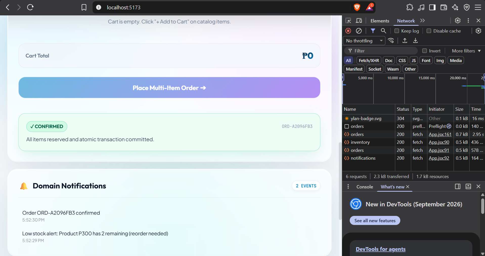
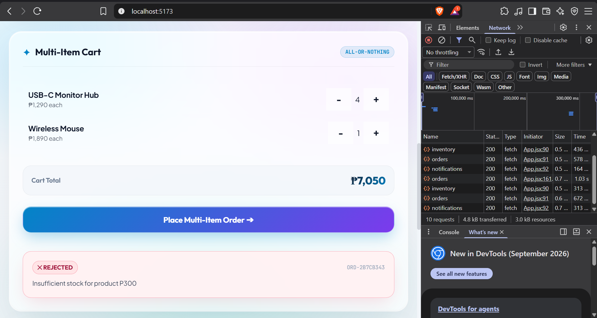
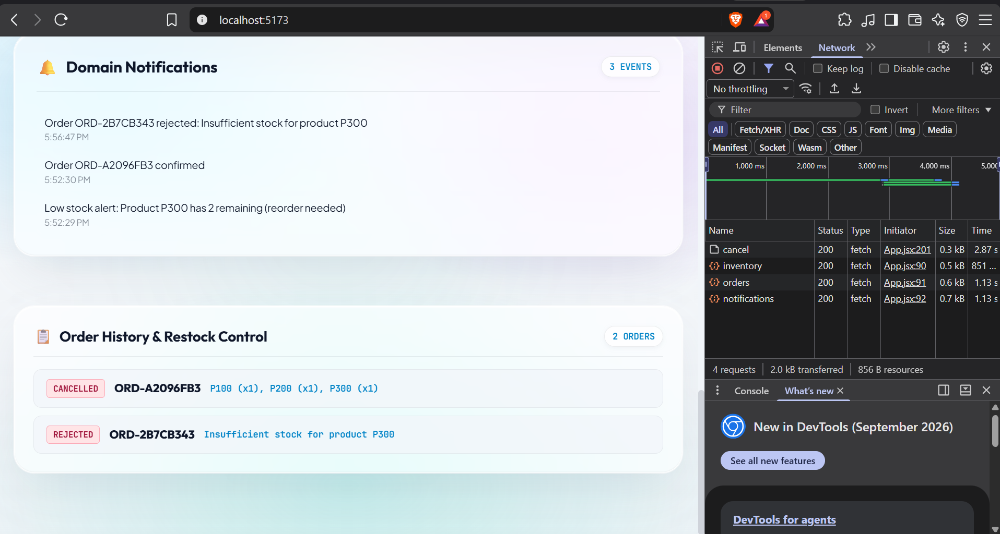

# Ylan's Shop — Modular Monolith Order, Inventory & Notification System (Activity 4 / Lab 2)

A modular in-process e-commerce system built with Spring Boot, Supabase PostgreSQL, and React. This lab extends the Order and Inventory modular monolith with multi-item transactional checkout, order cancellation with inventory restock, in-monolith domain events with a dedicated Notification module, and a low-stock auto-reorder alert rule.

---

## 1. Supabase PostgreSQL Setup Steps

1. **Supabase Database Project**:
   - Hosted PostgreSQL database in the Asia-Pacific (`ap-northeast-2`) region using connection pooling via port `5432` (`aws-0-ap-northeast-2.pooler.supabase.com`).
   - Configuration injected via environment variables (`SUPABASE_DB_URL`, `SUPABASE_DB_USERNAME`, `SUPABASE_DB_PASSWORD`) with application fallbacks.

2. **Complete Schema & Seed Script (`schema.sql`)**:
   - Run the following SQL in the Supabase SQL Editor to initialize all tables and seed data from scratch:

```sql
-- Inventory Table
CREATE TABLE IF NOT EXISTS inventory (
    product_id VARCHAR(50) PRIMARY KEY,
    product_name VARCHAR(100) NOT NULL,
    stock INT NOT NULL CHECK (stock >= 0)
);

-- Orders Table (Supports CONFIRMED, REJECTED, CANCELLED)
CREATE TABLE IF NOT EXISTS orders (
    order_id VARCHAR(50) PRIMARY KEY,
    status VARCHAR(20) NOT NULL,
    reason TEXT,
    created_at TIMESTAMP WITH TIME ZONE DEFAULT CURRENT_TIMESTAMP
);

-- Order Items Table (Multi-Item Order Relationships)
CREATE TABLE IF NOT EXISTS order_items (
    id SERIAL PRIMARY KEY,
    order_id VARCHAR(50) REFERENCES orders(order_id) ON DELETE CASCADE,
    product_id VARCHAR(50) NOT NULL,
    quantity INT NOT NULL CHECK (quantity > 0)
);

-- Notifications Table (Domain Event Feed Log)
CREATE TABLE IF NOT EXISTS notifications (
    notification_id SERIAL PRIMARY KEY,
    message TEXT NOT NULL,
    created_at TIMESTAMP DEFAULT CURRENT_TIMESTAMP
);

-- Seed Inventory Catalog
INSERT INTO inventory (product_id, product_name, stock) VALUES
    ('P100', 'Mechanical Keyboard', 25),
    ('P200', 'Wireless Mouse', 10),
    ('P300', 'USB-C Monitor Hub', 5)
ON CONFLICT (product_id) DO UPDATE 
SET product_name = EXCLUDED.product_name, stock = EXCLUDED.stock;
```

---

## 2. Network Tab Verification Evidence

Below are the verified test transactions captured from the browser DevTools Network tab:

### 1. Multi-Item Order Confirmed (All Items Succeed)
- **Request**: `POST /api/orders` with items `[P100 (x1), P200 (x1), P300 (x1)]`
- **Result**: HTTP 200 OK — `status: "CONFIRMED"`. All line items reserved atomically, reducing P300 stock to 2, and triggering a low-stock event.
- **Evidence**:
  

---

### 2. Multi-Item Order Rejected (All-or-Nothing Rollback)
- **Request**: `POST /api/orders` with items `[P300 (x4), P200 (x1)]` where P300 exceeds available stock (stock was 2).
- **Result**: HTTP 200 OK — `status: "REJECTED"`, reason `"Insufficient stock for product P300"`. Phase 1 validation halted checkout before reserving any item, preventing partial reservation of P200.
- **Evidence**:
  

---

### 3. Order Cancellation & Restock
- **Request**: `POST /api/orders/{orderId}/cancel` on confirmed order `ORD-A2096FB3`.
- **Result**: HTTP 200 OK. Status updated to `CANCELLED`, line items returned to inventory via `inventoryService.restock()`, and verified by the automatic subsequent `GET /api/inventory` request.
- **Evidence**:
  

---

### 4. Domain Notification Feed
- **Request**: `GET /api/notifications`
- **Result**: HTTP 200 OK. Returns the complete activity log showing all three event triggers:
  1. Confirmed Order event (`Order ORD-A2096FB3 confirmed`)
  2. Low Stock Alert event (`Low stock alert: Product P300 has 2 remaining (reorder needed)`)
  3. Rejected Order event (`Order ORD-2B7CB343 rejected: Insufficient stock for product P300`)
- **Evidence**:
  

---

## 3. Event Listener Concurrency: Synchronous vs. `@Async`

In this system, `@EventListener` methods in `NotificationEventListener` run **synchronously** within the caller's thread by default. This design was chosen for several reasons:

1. **Simplicity and Predictability**: Synchronous execution avoids the need for thread pool management (`@EnableAsync`), preventing thread exhaustion under traffic bursts.
2. **Deterministic UI State**: The frontend issues parallel `GET` requests (`/api/inventory`, `/api/orders`, `/api/notifications`) immediately after the `POST /api/orders` returns. Synchronous processing guarantees that notification records are committed to Supabase before the client requests the updated activity feed.
3. **Trade-offs**: In high-throughput production systems, synchronous listeners add write latency to the client request. If notification persistence were slow (e.g. sending emails or external webhooks), switching to `@Async` would be necessary to keep order placement non-blocking, handled with a dedicated task executor and retry mechanism.

---

## 4. Engineering Reflection

### In-Process Atomicity vs. Distributed Transactions
In our monolith, atomicity across multiple `InventoryService` calls is governed by Spring's in-memory `@Transactional` boundary and the underlying database connection. During checkout, Phase 1 validates all line items against current stock before any reservation occurs. When Phase 2 executes `inventoryService.reserve()` across items, all queries share the same transactional context. If any step fails or throws an exception, the entire transaction rolls back, ensuring zero partial reservations without data corruption. 

If Order and Inventory were split across separate network microservices, this single database transaction would no longer exist. Each service would manage its own isolated database, making ACID guarantees impossible across HTTP boundaries. To handle this, we would need to implement the **Saga Pattern** using either choreography or orchestration. In a multi-item saga, the Order service would send a reservation command for each item; if item three failed due to insufficient stock, the orchestrator would emit compensating transactions (e.g., `POST /api/inventory/cancel-reservation`) to undo previous reservations. We would also need idempotency keys, outbox tables, and dead-letter queues to handle network timeouts and partial failure states.

### Decoupling via Domain Events
Publishing domain events (`OrderPlacedEvent`, `OrderRejectedEvent`, `LowStockEvent`) through Spring's `ApplicationEventPublisher` fundamentally transforms the architectural coupling between `OrderService` and `Notification`. Previously, a direct service dependency would force `OrderService` to know about notification interfaces, method signatures, and database models, creating tight bidirectional coupling. With publish/subscribe, `OrderService` merely broadcasts that an event occurred in the domain and has zero awareness of who consumes it. The `Notification` module depends strictly on event DTOs, keeping its internal persistence completely encapsulated.

If Notification were extracted into an independent microservice, Spring's in-process event bus would be replaced by an external message broker such as **Apache Kafka** or **RabbitMQ**. OrderService would publish events to topics, and the Notification service would consume them asynchronously. To ensure reliable integration without dual-write inconsistencies (where a database commit succeeds but message publishing fails), we would implement the **Transactional Outbox Pattern** alongside message deduplication and at-least-once delivery guarantees.

### Extracting a Module: Service Extraction Choice
If forced to extract exactly one module into an independent microservice, I would extract the **Notification Module** first. 

Architecturally, Notification has the lowest business coupling and is non-critical to the core checkout loop: a delay or failure in logging a notification does not prevent an order from being confirmed or inventory from being reserved. In contrast, splitting Inventory requires distributed transactions, distributed locking, and compensating sagas. 

To extract Notification:
1. Move `edu.cit.soldano.notification` into a standalone Spring Boot project with its own database.
2. Replace Spring's in-process `ApplicationEventPublisher` with a message broker (e.g., RabbitMQ or Kafka) or an HTTP webhook consumer.
3. Remove Notification endpoints from the monolith's gateway. The core `shop` and `inventory` business logic would require zero changes, as they already only interact via published domain events.
